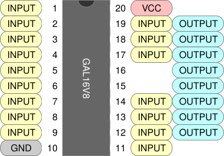
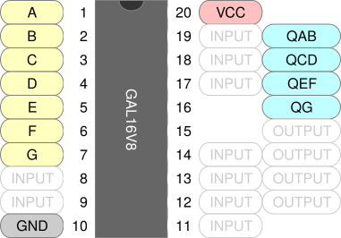

+++
date = '2026-09-15T13:45:18-05:00'
draft = false
title = 'GALs by Example, Part 1'
+++

GALs are simple programmable logic devices, (SPLDs) which are old technology but are [still available](https://www.digikey.com/en/products/filter/embedded/plds-programmable-logic-device/719?s=N4IgTCBcDaIOYEMA2IC6BfIA) and they remain popular among hobbysist as way to reduce the number of logic ICs in a project. Let's learn how to use them!

<!--more-->


Unlike their newer cousins the **complex** programmable logic devices (CPLDs), GALs can be programmed with open-source software and inexpensive hardware. Truly modern programmable logic is dominated by field programmable gate arrays (FPGAs), but these are much more complex, have limited open-source support, and require auxiliary circuity to support their operation. GALs are very limited when compared to their modern counterparts, but they are much, much easier to use.

Our basic workflow:
- Write a source file.
- Assemble it into a JEDEC file using GALasm.
- Write the JEDEC file to a GAL using minipro.
- Test the GAL, also using minipro.

### GAL16V8 in Simple Mode

To me the GAL16V8 is the Arduino Uno of the GAL world. It's a 20-pin device with 16 pins that can be used as inputs and 8 that can be used as outputs (hence the name). We're going to start with the GAL16V8 and use it in its simplest mode, conveniently called "simple mode", which allows only for combinational logic. Here is the pinout when used in simple mode.



### Writing a Logic Demo

As far as I know, nobody manufactures a logic chip providing an AND gate, an OR gate, an XOR gate, and a NOT gate. So let's make one using a GAL16V8 in simple mode.

First let's label our pins. We'll need seven inputs and four outputs. I will use pins 1-7 for inputs (`A`-`G`) and 16-19 for outputs (`Q*`), but this is arbitrary and you can use any valid pins you like.



Let's start writing our GALasm source. At the top of the file we write a prelude that specifies our pin labels, as well as a few other things.

```pld {filename="logidemo.pld"}
GAL16V8
LOGIDEMO

A  B  C  D  E  F  G   NC  NC  GND 
NC NC NC NC NC QG QEF QCD QAB VCC
```

Observe the following about the prelude:

- The first line identifies the GAL type.
- The second line is an arbitary signature of up to 8 ASCII characters.
- The next two lines label the pins in order from 1-10 and then 11-20.
- The special labels `GND` and `VCC` must be specified for power; and the special label `NC` must be specified for unused pins.

After labeling the pins we provide **equations** that compute the outputs from the inputs.

```pld
; equations start here
QAB = A & B
QCD = C
    # D
QEF = E & /F
    # F & /E
QG  = /G
```

Note the following:
- Equations must be in [Disjunctive Normal Form](https://en.wikipedia.org/wiki/Disjunctive_normal_form), colloquially "sum of products".
- We express AND and OR with `&` and `#`, or with `*` and `+`. Best to choose one style and stick with it.
- Inputs can be negated with `/`.
- Equations can be broken across lines however you like, but it seems most common to have one product term per line.
- Comments start with a `;` and go to the end of the line. They cannot appear in the prelude.

The epilogue of our source file *must* contain the `DESCRIPTION` keyword, so you might as well go ahead and write a description. Our final source file is as follows:

```pld {filename="logidemo.pld"}
GAL16V8
LOGIDEMO

A  B  C  D  E  F  G   NC  NC  GND 
NC NC NC NC NC QG QEF QCD QAB VCC

; equations start here
QAB = A & B
QCD = C
    # D
QEF = E & /F
    # F & /E
QG  = /G

DESCRIPTION
Example GAL definition with several combinational logic gates.
```

You may have noticed that we never declare that we want simple operating mode, nor do we specify which pins are inputs and which are outputs. Intead GALasm **infers** these properties from the equations.

### Assembly

Before we assemble our source we need to install [GALasm](https://github.com/daveho/GALasm). Download the repo, go into `src`, and `make`. The output is a single binary `galasm` that you can move wherever you want.

And now, we assemble:

```
galasm (main)$ galasm -v logidemo.pld
GALasm 2.1, Portable GAL Assembler
Copyright (c) 1998-2003 Alessandro Zummo. All Rights Reserved
Original sources Copyright (c) 1991-96 Christian Habermann

Assembler Phase 1 for "logidemo.pld"
Assembler Phase 2 for "logidemo.pld"
Defaulting to simple mode
GAL16V8; Operation mode: simple; Security fuse off
Assembling successfully completed.
$ _
```

If everything went well you will see something like the output above. Note that the next-to-last line identifies the operation mode as **simple**.

There are four output files:

| File         | Descripion                                          |
| :----------- | :------                                          |
| `logidemo.chp` | An ASCII-art picture of the IC, with our pin labels. |
| `logidemo.pin` | A text file with a table of pin types and labels. |
| `logidemo.fus` | Human-readable tables for the fuses that will be set in the GAL. |
| `logidemo.jed` | JEDEC file that we can actually program onto the GAL. |

If things did *not* go well you may have been presented with an error message, and it might not make any sense. If the error is `Error: Not enough free memory!` it can mean a lot of things, including file not found. You'll have to mess around and figure out what's going on.

### Programming

Now that we have our JEDEC file we can program the GAL with [minipro](https://gitlab.com/DavidGriffith/minipro). See the repo's README for installation instructions; it's available on many package managers. You will also need a TL866 or [T48](https://www.amazon.com/s?k=T48+programmer) programmer, and it needs to be plugged into your computer.

There are many variations of the GAL16V8, so check the list on minipro and see if yours shows up. Unless specified otherwise the package is DIP.

```
galasm (main)$ minipro -L GAL16V8
Found TL866II+ 04.2.123 (0x27b)
Warning: Firmware is out of date.
  Expected  04.2.132 (0x284)
  Found     04.2.123 (0x27b)
Device code: 02106811
Serial code: N95SXK8LUBRHLHXHQG4Y
USB speed: 12Mbps (USB 1.1)
GAL16V8
GAL16V8@SOIC20
GAL16V8A
GAL16V8A@SOIC20
GAL16V8B
GAL16V8B@SOIC20
GAL16V8C
GAL16V8C@SOIC20
GAL16V8D
GAL16V8D@SOIC20
$ _
```

`GAL16V8D` seems to be the common modern variant (sometimes there are other letters before the `D`).

To program, place your GAL in the programmer's ZIF socket, aligning it according to the indication on the programmer. Then program, using your best guess for the part number:

```
$ minipro -p GAL16V8D -w logidemo.jed
Found TL866II+ 04.2.123 (0x27b)
Warning: Firmware is out of date.
  Expected  04.2.132 (0x284)
  Found     04.2.123 (0x27b)
Device code: 02106811
Serial code: N95SXK8LUBRHLHXHQG4Y
USB speed: 12Mbps (USB 1.1)

VPP=16V
Declared fuse checksum: 0x24B7 Calculated: 0x24B7 ... OK
Declared file checksum: 0x6B98 Calculated: 0x6B98 ... OK
JED file parsed OK

Erasing... 0.83Sec OK
Writing jedec file...  3.45Sec  OK
Reading device...  0.09Sec  OK
Verification OK
$ _
```

And that's it. You can put the GAL on a breadboard and try it out, or keep reading and write a unit test.  If programming fails, check the part number. If verification fails you may have a defective GAL. I just threw one in the trash for this reason.

### Testing

We can write a minipro testcase with an XML file. Each `<vector>` below is a single test, specifying pins from 1 to 20, where `0` or `1` drives the pin and `H` or `L` are expected outputs. `X` means "don't care", and `V`/`G` are for power. Whitespace is ignored so I grouped the pins in a way that made sense to me.

```xml {filename="logidemo.xml"}
<?xml version="1.0" encoding="utf-8"?>
<logicic>
  <database type="LOGIC">
    <custom name="whatever-you-want">
      <ic name="logidemo" type="5" voltage="5V" pins="20">

          <!-- AND gate at pins 1-2, output on 19 -->
          <vector> 00 XX XX X XXG XXXXX X X X L V </vector>
          <vector> 01 XX XX X XXG XXXXX X X X L V </vector>
          <vector> 10 XX XX X XXG XXXXX X X X L V </vector>
          <vector> 11 XX XX X XXG XXXXX X X X H V </vector>

          <!-- OR gate at pins 3-4, output on 18 -->
          <vector> XX 00 XX X XXG XXXXX X X L X V </vector>
          <vector> XX 01 XX X XXG XXXXX X X H X V </vector>
          <vector> XX 10 XX X XXG XXXXX X X H X V </vector>
          <vector> XX 11 XX X XXG XXXXX X X H X V </vector>

          <!-- XOR gate at pins 5-6, output on 17 -->
          <vector> XX XX 00 X XXG XXXXX X L X X V </vector>
          <vector> XX XX 01 X XXG XXXXX X H X X V </vector>
          <vector> XX XX 10 X XXG XXXXX X H X X V </vector>
          <vector> XX XX 11 X XXG XXXXX X L X X V </vector>

          <!-- NOT gate at pin 7, output on 16 -->
          <vector> XX XX XX 0 XXG XXXXX H X X X V </vector>
          <vector> XX XX XX 1 XXG XXXXX L X X X V </vector>

        </ic>
    </custom>
  </database>
</logicic>    
```

Running the test with `minipro` shows no errors!

```
$ minipro -T -p logidemo --logicic logidemo.xml
Using overridden database file logidemo.xml
Found TL866II+ 04.2.123 (0x27b)
Warning: Firmware is out of date.
  Expected  04.2.132 (0x284)
  Found     04.2.123 (0x27b)
Device code: 02106811
Serial code: N95SXK8LUBRHLHXHQG4Y
USB speed: 12Mbps (USB 1.1)
      1  2  3  4  5  6  7  8  9  10 11 12 13 14 15 16 17 18 19 20 
0000: 0  0  X  X  X  X  X  X  X  G  X  X  X  X  X  X  X  X  L  V  
0001: 0  1  X  X  X  X  X  X  X  G  X  X  X  X  X  X  X  X  L  V  
0002: 1  0  X  X  X  X  X  X  X  G  X  X  X  X  X  X  X  X  L  V  
0003: 1  1  X  X  X  X  X  X  X  G  X  X  X  X  X  X  X  X  H  V  
0004: X  X  0  0  X  X  X  X  X  G  X  X  X  X  X  X  X  L  X  V  
0005: X  X  0  1  X  X  X  X  X  G  X  X  X  X  X  X  X  H  X  V  
0006: X  X  1  0  X  X  X  X  X  G  X  X  X  X  X  X  X  H  X  V  
0007: X  X  1  1  X  X  X  X  X  G  X  X  X  X  X  X  X  H  X  V  
0008: X  X  X  X  0  0  X  X  X  G  X  X  X  X  X  X  L  X  X  V  
0009: X  X  X  X  0  1  X  X  X  G  X  X  X  X  X  X  H  X  X  V  
0010: X  X  X  X  1  0  X  X  X  G  X  X  X  X  X  X  H  X  X  V  
0011: X  X  X  X  1  1  X  X  X  G  X  X  X  X  X  X  L  X  X  V  
0012: X  X  X  X  X  X  0  X  X  G  X  X  X  X  X  H  X  X  X  V  
0013: X  X  X  X  X  X  1  X  X  G  X  X  X  X  X  L  X  X  X  V  
Logic test successful.
$ _
```

See this [post about testing GALs](../testing-gals/) for much more detail.

### Other Features

Here are some other features that can be useful in simple mode. We will revisit these in later posts.

#### Feedback

Output pins provide **feedback**, which allows equations to mention outputs in their right-hand sides. For example, we could write equations that computes `AND` and `OR` and re-use these results to compute `XOR`.

```pld
QAND = A & B
QOR  = A # B
QXOR = OR & /AND      ; this equation mentions *outputs*
```

Feedback isn't strictly necessary in simple mode, but it can save some repetition. When we get to **registered** mode we will use feedback to see prior values stored on the previous clock cycle, allowing for sequential logic.

#### Active-Low Pins

When we write equations we should really think of `A` and `/A` as meaning pin A is logically **asserted** or **non-asserted**, as opposed to thinking about physical voltage. Pins are active-high by default, but we can mark pins as **active low** when we declare pin labels by preceding the label with a `/`. For instance, making this single change to our example above effectively changes the first gate from AND to NAND. 

```
A  B  C  D  E  F  G   NC  NC   GND 
NC NC NC NC NC QG QEF QCD /QAB VCC
```

We still refer to the pin as `QAB` in the rest of our code and it's still asserted when `A` and `B` are both asserted, but assertion of `QAB` now means that the output will now be low rather than high. This also works for input pins; signals like "enable" are often active low. 

The takeaway is that the choice of active-high or active-low is **orthogogonal** to your equations, which should be written in terms of assertion rather than physical logic level.


#### Pullups

The GAL16V8 provides active pullups for inputs and unassigned outputs, which allows (for example) an input to be connected to ground through a switch without an additional pull-up, becauese the floating input will be pulled to a logic high. 

Pull-downs in the TL866 programmer seem to make it impossible to create truly floating inputs for tests; inputs marked with an `X` seem to have indeterminate logic values. So you need to pop the GAL into a breadboard to test this behavior. An [99¢ Logic Probe](https://www.aliexpress.us/item/3256809162514046.html) is great for this kind of thing.

### Exercises

I encourge you to do some of these exercises (or make up some of your own) before moving on to the next post.

- Change `QCD` to compute NOR and verify that the test fails. Fix the test.
- Play around with active-low inputs and outputs until you're confident you understand how they work.
- Use a breadboard to check the behavior of floating inputs and unused outputs.
- Modify equations to ouput `AND`, `OR`, and `XOR` for a *single* pair of inputs. Add some other relations like `NAND`. Feedback can be useful here.
- Build a half adder, taking inputs `A0` and `A1` and producing output `S` for the sum and `CO` for the carry out.
- Build a full adder, taking inputs `A0` and `A1` as well as `CI` for carry in, producing output `S0` and `S1` for the sum and `CO` for final carry out.
- Build a 7-segment LED decoder, taking inputs `D0` through `D3` and producing outputs `A` through `G` for the LED segments such that the hexadecimal value of the 4-bit input is displayed as `0`..`F`.