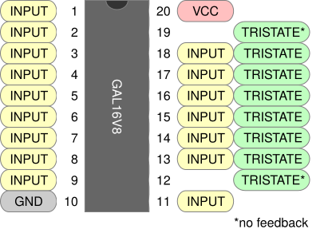
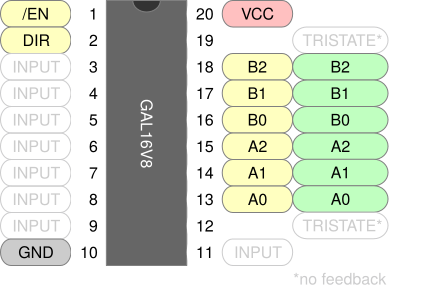

+++
date = '2026-09-17T09:43:53-05:00'
draft = true
title = 'Gals by Example, Part 2'
+++

In [part one](../gals-by-example-1/) we learned about using the GAL16V8 in **simple** mode, which allows only pure combinational logic. In this post we will learn how to use **tri-state logic** in **complex** mode.

<!--more-->


In **simple** mode, outputs could only be high or low. In this post we introduce **complex** mode, which adds the possibility of outputs being **individually disabled**. Disabled ouputs retain feedback and can be used as inputs, so they are effectively bidirectional.

### GAL16V8 in Complex Mode

In complex mode we still have 16 input pins and 8 output pins, but they are arranged slightly differently. Here is the pinout when in complex mode.



Note that the pins 12 and 19 do not have feedback in this mode. This means they cannot be used in the right-hand side of an equation.

### A Bidirectional Buffer

Many systems use a shared data bus, where components read and write to the same data lines. At any moment a component can be reading, writing, or ignoring the shared bus. A useful component to have in this situation is a bi-directional buffer with tri-state outputs, so that's what we're going to build.

Our buffer will gate access to a three-bit bus. Data can flow from A to B, from B to A, or can be disconnected entirely. This is like a 3-bit version of a [74LS245](https://www.ti.com/lit/ds/symlink/sn74ls245.pdf) bus transceiver.



Our choice of pins is more constrained this time. The inputs on the left can go anywhere, but we need feedback on our tri-state outputs so we can only use the six middle pins on the right side.

Our GALasm prelude has the same format as in simple mode. Note that output `OE` is active low. `DAB` means "direction is from A to B".

```pld {filename="buffer.pld"}
GAL16V8
BUFFER

/OE DAB NC NC NC NC NC NC NC GND 
NC  NC  A0 A1 A2 B0 B1 B2 NC VCC
```

The equations are a little different from what we saw in part one. Here are the equations for data flowing from A to B.

```
; A -> B when enabled and DAB is asserted

B0.T = A0
B1.T = A1
B2.T = A2

B0.EN = OE & DAB
B1.EN = OE & DAB
B2.EN = OE & DAB
```

Note the following:
- We define a tri-state output by adding the `.T` suffix. This means that `B0` will have `A0`'s value, but only when `B0` is enabled.
- For each tri-state output we use a **second** equation to specify when the output is enabled, via the `.EN` suffix. In this case the B outputs are all enabled when output is enabled and the direction is from A to B.
- GALasm requires that each `.T` equation appear before its associated `.E` equation in the source file.

The B to A flow is defined analogously, swapping `A` and `B` and enabling output when `DAB` is *not* asserted. Here is our final source file.

```pld {filename="buffer.pld"}
GAL16V8
BUFFER

/OE DAB NC NC NC NC NC NC NC GND 
NC  NC  A0 A1 A2 B0 B1 B2 NC VCC

; A -> B when enabled and DAB is asserted

B0.T = A0
B1.T = A1
B2.T = A2

B0.EN = OE & DAB
B1.EN = OE & DAB
B2.EN = OE & DAB

; B -> A when enabled and DAB is disasserted

A0.T = B0
A1.T = B1
A2.T = B2

A0.EN = OE & /DAB
A1.EN = OE & /DAB
A2.EN = OE & /DAB

DESCRIPTION
A 3-bit bidirectional buffer.
```

### Assembly and Programming

We assemble as we did in [part one](../gals-by-example-1/). The `-v` is optional but sometimes provides more output, which can be useful for debugging.

```
$ galasm -v buffer.pld
GALasm 2.1, Portable GAL Assembler
Copyright (c) 1998-2003 Alessandro Zummo. All Rights Reserved
Original sources Copyright (c) 1991-96 Christian Habermann

Assembler Phase 1 for "buffer.pld"
Assembler Phase 2 for "buffer.pld"
Using complex mode because:
  pin 13 (A0) is configured as tri-state output
  pin 14 (A1) is configured as tri-state output
  pin 15 (A2) is configured as tri-state output
  pin 16 (B0) is configured as tri-state output
  pin 17 (B1) is configured as tri-state output
  pin 18 (B2) is configured as tri-state output
GAL16V8; Operation mode: complex; Security fuse off
Assembling successfully completed.
$ _
```

Note that the operation mode has been inferred as **complex** due to the presence of tri-state outputs. Programming is the same as in part one.

```
$ minipro -p GAL16V8D -w buffer.jed
Found TL866II+ 04.2.123 (0x27b)
Warning: Firmware is out of date.
  Expected  04.2.132 (0x284)
  Found     04.2.123 (0x27b)
Device code: 02106811
Serial code: N95SXK8LUBRHLHXHQG4Y
USB speed: 12Mbps (USB 1.1)

VPP=16V
Declared fuse checksum: 0x3A5E Calculated: 0x3A5E ... OK
Declared file checksum: 0x990C Calculated: 0x990C ... OK
JED file parsed OK

Erasing... 0.83Sec OK
Writing jedec file...  3.45Sec  OK
Reading device...  0.09Sec  OK
Verification OK
$ _
```

### Testing

Our testing strategy is the same as in [part one](../gals-by-example-1/), with one difference: when output is disabled we want to verify that the outputs are indeed disconnected. For this we use the `Z` output state.

```xml {filename="buffer.xml"}
<?xml version="1.0" encoding="utf-8"?>
<logicic>
  <database type="LOGIC">
    <custom name="whatever-you-want">
      <ic name="buffer" type="5" voltage="5V" pins="20">

          <!-- A to B  -->
          <vector> 01 XXXXXXXG XX 000 LLL XV </vector>
          <vector> 01 XXXXXXXG XX 101 HLH XV </vector>
          <vector> 01 XXXXXXXG XX 111 HHH XV </vector>
          <vector> 11 XXXXXXXG XX 101 ZZZ XV </vector>

          <!-- B to A  -->
          <vector> 00 XXXXXXXG XX LLL 000 XV </vector>
          <vector> 00 XXXXXXXG XX HLH 101 XV </vector>
          <vector> 00 XXXXXXXG XX HHH 111 XV </vector>
          <vector> 10 XXXXXXXG XX ZZZ 101 XV </vector>

        </ic>
    </custom>
  </database>
</logicic>    
```

We run tests as before.

```
$ minipro -T -p buffer --logicic buffer.xml
Using overridden database file buffer.xml
Found TL866II+ 04.2.123 (0x27b)
Warning: Firmware is out of date.
  Expected  04.2.132 (0x284)
  Found     04.2.123 (0x27b)
Device code: 02106811
Serial code: N95SXK8LUBRHLHXHQG4Y
USB speed: 12Mbps (USB 1.1)
      1  2  3  4  5  6  7  8  9  10 11 12 13 14 15 16 17 18 19 20 
0000: 0  1  X  X  X  X  X  X  X  G  X  X  0  0  0  L  L  L  X  V  
0001: 0  1  X  X  X  X  X  X  X  G  X  X  1  0  1  H  L  H  X  V  
0002: 0  1  X  X  X  X  X  X  X  G  X  X  1  1  1  H  H  H  X  V  
0003: 1  1  X  X  X  X  X  X  X  G  X  X  1  0  1  Z  Z  Z  X  V  
0004: 0  0  X  X  X  X  X  X  X  G  X  X  L  L  L  0  0  0  X  V  
0005: 0  0  X  X  X  X  X  X  X  G  X  X  H  L  H  1  0  1  X  V  
0006: 0  0  X  X  X  X  X  X  X  G  X  X  H  H  H  1  1  1  X  V  
0007: 1  0  X  X  X  X  X  X  X  G  X  X  Z  Z  Z  1  0  1  X  V  
Logic test successful.
$ _ 
```

### Exercises

- Turn this into an **inverting** buffer.
