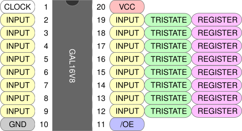
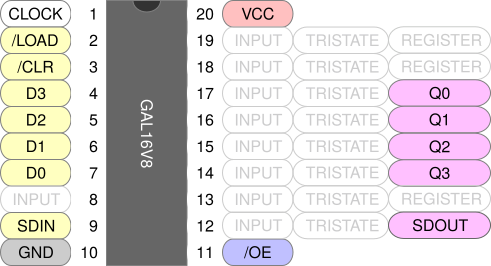

+++
date = '2026-09-17T13:28:53-05:00'
draft = true
title = 'GALs by Example, Part 3'
+++


In [part two](../gals-by-example-2/) we learned how to use tri-state outputs to control access to and from a shared data bus. In this post we will learn how to implement **sequential logic** by using the GAL16V8 in **registered** mode.

<!--more-->


### GAL16V8 in Registered Mode

In registered mode we again have 16 inputs and 8 outputs, but the outputs can now be **registered**, meaning they do not output their values immediately, but rather latch these values on the rising edge of the **clock** (dedicated pin 1). All registered outputs share a single **output-enable** (dedicated pin 11). Here is the pinout in registered mode.



At first glance it might appear that this mode is strictly better than complex mode, as tri-state outputs are still allowed in this mode (and none have the "no feedback" restriction). The catch is that while you can indeed have eight tri-state outputs in this mode, this would leave you with only eight inputs due to pins 1 and 11 being dedicated to `CLK` and `/OE`. In complex mode you would have ten inputs available. **However** as far as I can tell, GALasm will only select registered mode if there is at least one registered output, so this question may be academic.

### A Parallel-Load Shift Register

A common task in electronics is turning serial data into a paralle data, which we do via a [shift register](https://en.wikipedia.org/wiki/Shift_register). We will implement a 4-bit shift register with parallel load using a GAL16V8 in registered mode.



Bits shift in via `SDIN` on the rising edge of `CLK`, through bits `Q0`, `Q1`, `Q2`, `Q3`, and finally `SDOUT`. If `/LOAD` is asserted then the values on `D[0:4]` are copied to `Q[0:4]` on the rising clock. If `/CLR` is asserted then all bits are cleared on the rising clock.

Here is the GALasm source in its entirety.

```pld {filename="shift.pld"}
GAL16V8
SHIFT

CLK /LOAD /CLR D3 D2 D1 D0 NC SDIN GND
/OE SDOUT  NC  Q3 Q2 Q1 Q0 NC NC   VCC

Q0.R    = /CLR &  LOAD & D0
        # /CLR & /LOAD & SDIN

Q1.R    = /CLR &  LOAD & D1
        # /CLR & /LOAD & Q0

Q2.R    = /CLR &  LOAD & D2
        # /CLR & /LOAD & Q1

Q3.R    = /CLR &  LOAD & D3
        # /CLR & /LOAD & Q2

SDOUT.R = /CLR & /LOAD & Q3

DESCRIPTION
A 4-bit parallel load shift register.
```

Note the following:
- We must specify `CLK` at pin 1 and `/OE` at pin 11. These are keyword labels like `VCC` and `GND`.
- Registered outputs have the `.R` suffix. The value is latched on the rising `CLK`.
- Much like tri-state outputs, we refer to the feedback from registered outputs *without* a suffix. These refer to **current** latched values, which we use to compute the **next** latched values.

### Testing

Here is a test suite for the shift register. Note the use of the `C` token for pin 1. This instructs minipro to issue a positive-going clock pulse before checking the output bits. Agan, refer to the [post on testing GALs](../testing-gals/) for more information.

```xml {filename="buffer.xml"}
<?xml version="1.0" encoding="utf-8"?>
<logicic>
  <database type="LOGIC">
    <custom name="whatever-you-want">
      <ic name="shift" type="5" voltage="5V" pins="20">

          <vector> C 01 1011 X X G 0 L X HLHH XXV </vector> <!-- Load -->
          <vector> X XX XXXX X X G 1 Z X ZZZZ XXV </vector> <!-- Disable -->
          <vector> X XX XXXX X X G 0 L X HLHH XXV </vector> <!-- Enable -->
          <vector> C 11 XXXX X 0 G 0 H X LHHL XXV </vector> <!-- Shift a 0 -->
          <vector> C 11 XXXX X 1 G 0 L X HHLH XXV </vector> <!-- Shift a 1 -->
          <vector> C 11 XXXX X 1 G 0 H X HLHH XXV </vector> <!-- Shift a 1 -->
          <vector> C X0 XXXX X X G 0 L X LLLL XXV </vector> <!-- Clear -->
          
        </ic>
    </custom>
  </database>
</logicic>    
```

### Exercises

- Write a 4-bit counter.
- Program two of these and chain them together through `SDOUT` and `SDIN` to create an 8-bit shift register.

