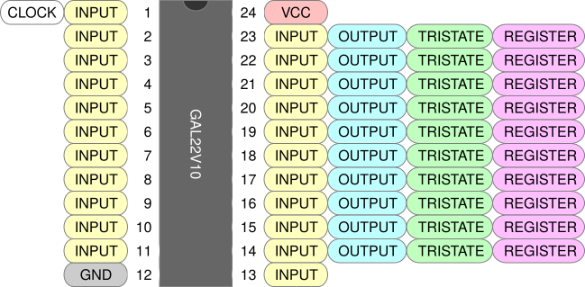

+++
date = '2026-09-20T13:45:57-05:00'
draft = true
title = 'GALs by Example, Part 4'
+++

In the exciting conclusion to this series we will meet the **GAL22V10**, the larger and simpler cousin to the GAL16V8.

<!--more-->

### The GAL22V10

The GAL22V10 is a 24-pin device with 22 input pins and 10 output pins. There is only one operating mode. All outputs can independently be combinatorial, tri-state, or registered, with individual enable signals and no feedback restrictions. There are internal asynchronous reset and synchronous preset lines that can be driven if desired. Here is the pinout.

