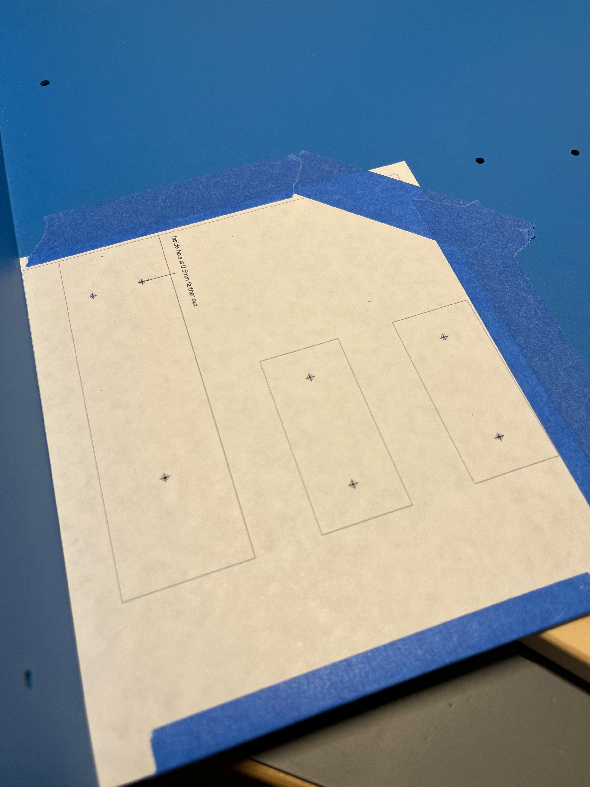
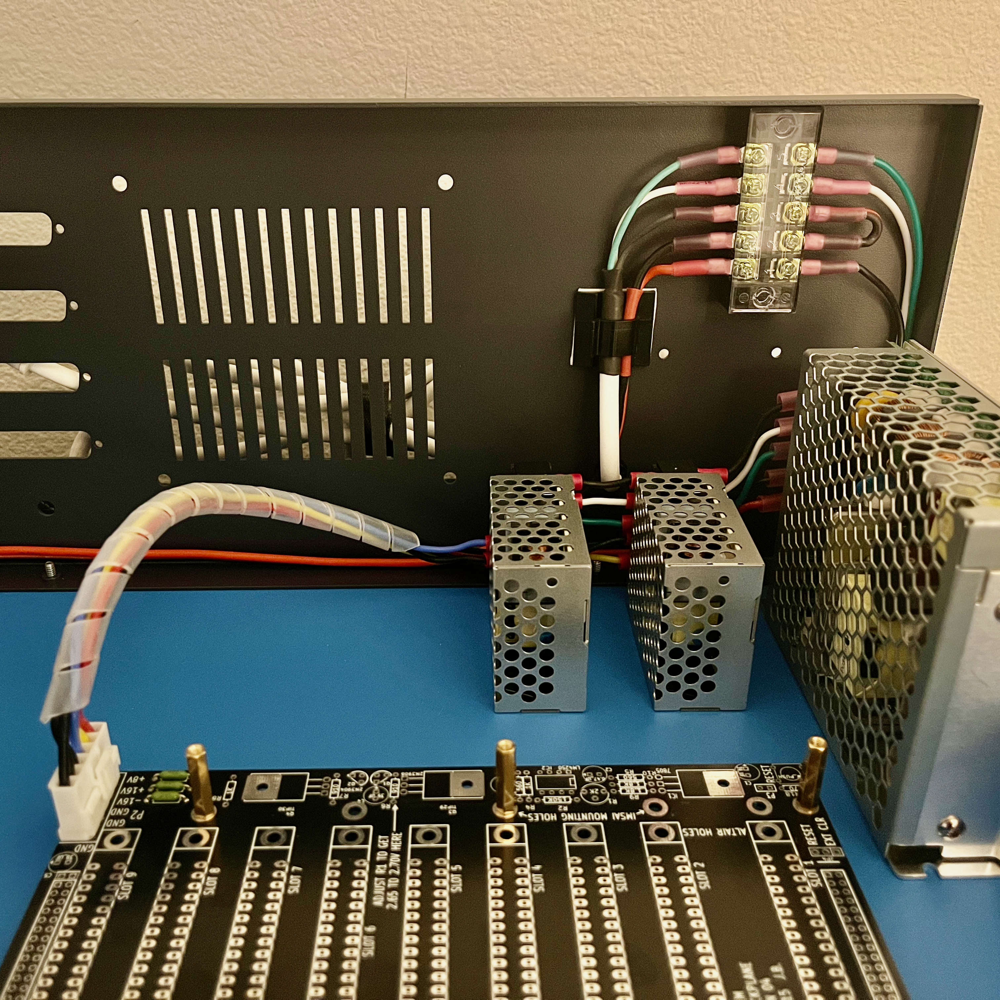
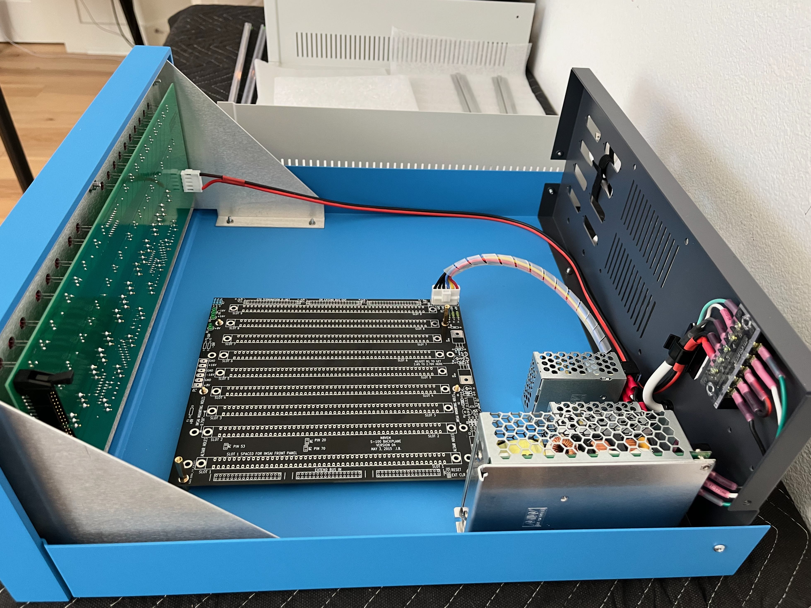
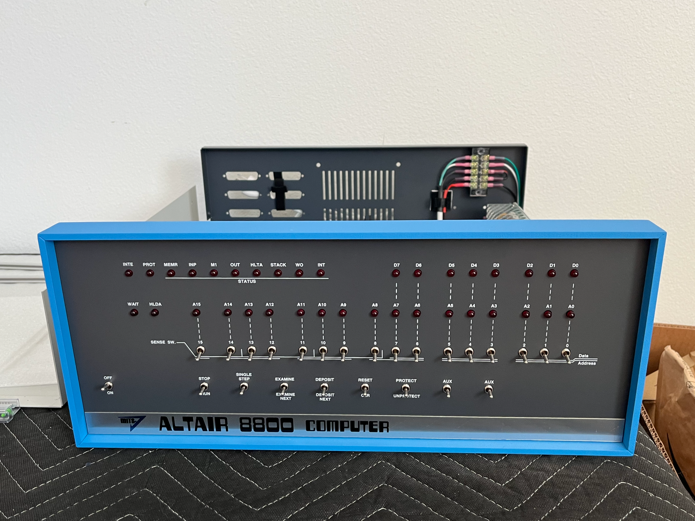

### The Plan

My goal for the build was a machine that could boot CP/M from floppy, which requires a *lot* of stuff to work. But fortunately there were
a number of satisfying intermediate goals and I also had pretty good luck.

So I bought a cabinet and front panel boards from [Mike Douglas](https://deramp.com) and got building.

### Power Supplies

Cards in the Altair generally need +5V and ±12V, regulated down from +7.5V and ±15V bus power. I used switching supplies from Mean Well (10A for 7.5V and 1A for 15V), which are very efficient, and my machine has not required active cooling.

Mean Well has good mechanical drawings of their power supplies so I was able to create a drilling template and had no trouble getting the power supplies where I wanted them. The end result (third tab below) was satisfying and I think keeping it neat has paid off.



  
  
  



### Backplane

There are a few common S-100 backplane designs available online. The original Altair came with a 4-slot backplane, which everyone agreed was entirely inadequate, so I got a 9-slot variant. There is room in the cabinet for a larger one, but having the extra room behind the IO connectors has been useful and I haven't yet run out of card slots.

The Altair uses a totally passive backplane, so the only things I needed to populate were the power connector, fuses, and LEDs with their resistors. And of course nine expensive connectors, each with ONE HUNDRED PINS. It took a few evenings to get this soldered.

### Front Panel

Somehow I don't have any photos of the front panel board under construction, but the process is documented well in other places (including the excellent [manual](https://deramp.com/downloads/altair/hardware/altair_8800c/Front%20Panel%20Manual.pdf)). It's a lot of soldering and getting all the LEDs and switches lined up is very important to the final look, so I took it slow and it came out well.



  
  



The front panel connects via a 50-pin ribbon cable to the front panel interface card, which in turn connects to the CPU card with an additional 8-pin cable (for signals it needs that are not exposed on the bus). Assembly of this interface card must have been uneventful because I don't have any photos.

### CPU Card

The CPU card (from eBay) is a reproduction of the original card from MITS, which calls for some parts that are very obsolete and are hard to find. These I got from eBay (US sellers only; obsolete parts from Chinese sellers are almost always fake) and from [Unicorn Electronics](https://unicornelectronics.com), which is a strange business but the parts did eventually show up. For instructions I used the original Altair assembly manual from 1975.

The Intel 8080 has an asymmetric two-phase clock with fairly strict timing requirements, which is a challenge on this board because the clock circuit is dependent on slow mid-70s switching speeds. This is apparently a common point of frustration, so for the benefit of future builders: I got good clock timing with a 7404 (not LS, plain 7404) and 74LS123 for ICs P and Q; with 5.6k and 4.3k for R41 and R42.

With the CPU card installed I was able to use the front panel to step through addresses, which doesn't sound like much but it was very exciting. Next up was getting some memory in the machine.

### FDC+

The disk controller card I bought was an [FDC+](https://deramp.com/fdc_plus.html) in part because it can be configured to act like several kinds of disk controllers, but also because it includes 64k of RAM and an EEPROM containing a memory monitor and boot loader. So this is a drop-in replacement for what would have been six cards back in the 70s. This card was only available fully assembled, which is the only point at which I felt I was kind of cheating.

In any case I installed this card to get some memory going, and was finally able to toggle in and play Kill the Bit!

<video src="assets/kill-the-bit.mp4" controls>Your browser does not support the video tag.</video>

### 88-2SIOJP

Next up was getting serial communication working. For this I built up an [88-2SIOJP](https://deramp.com/2SIOJP.html). This card is a drop-in replacement for the MITS 88-2SIO with some extra conveniences like DIP switches for setting baud rates (the original card required soldering to do this). 

This board went together without undue drama and soon I was able to run the ROM monitor. Don't worry, I did manage to fix the cataracts on the ADM-3A.

<video src="assets/monitor.mp4" controls>Your browser does not support the video tag.</video>

So that's it for part one! Next up is getting floppies working, in [part two](../main_2/).
