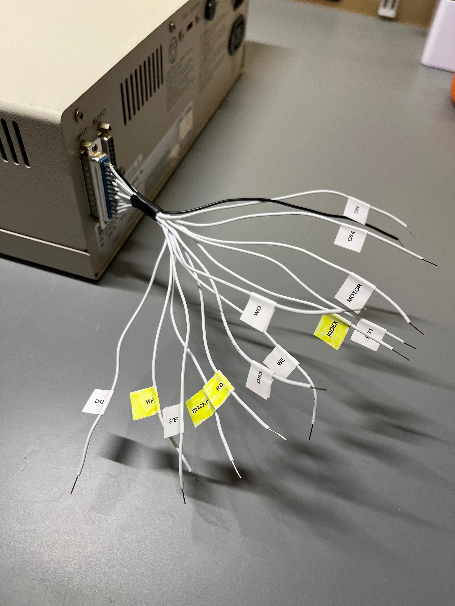
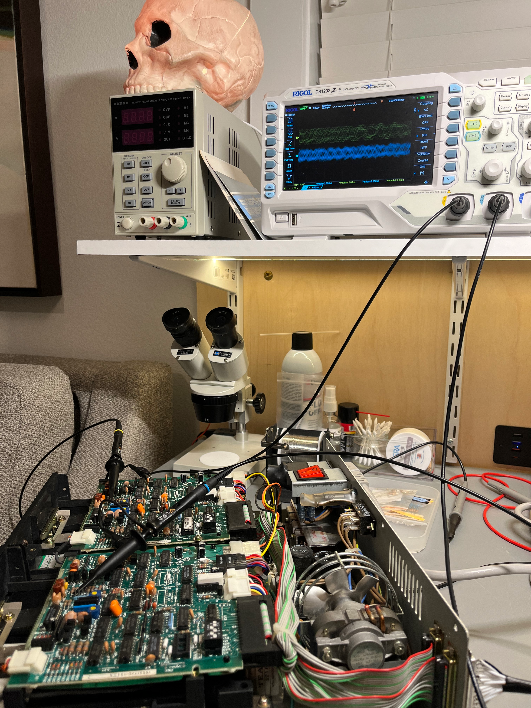
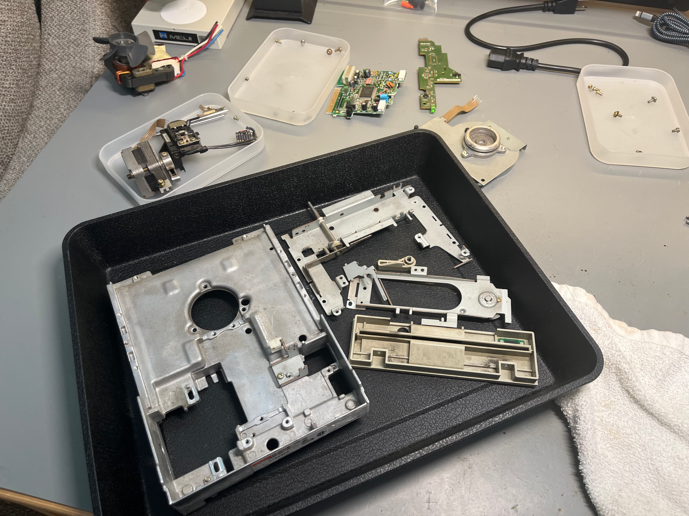
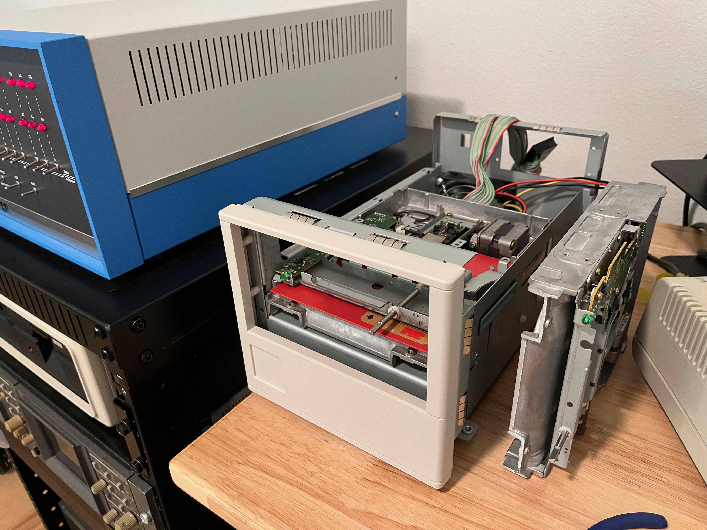

### Authentic Floppy Drives

In order to attach floppy drives to an Altair, one must first have some floppy drives. I got this DEC RX-180 on eBay with no real expectation that it would work, but it wasn't super hard to get it going. These are single-sided, single-density drives that give you about 90k each using the Altair Minidisk adapter (or in my case the [FDC+](https://deramp.com/fdc_plus.html) in Minidisk mode).

The rear connector is a DB-25 instead of a ribbon cable, which is much nicer to work with when you're running cables around in a rack, but I had to figure out what was connected to what. It turns out they used the same pin numbering as on the standard ribbon connector, so it ended up not being a big deal. Other than a shorted tantalum capacitor and the drives being out of alignment it ended up being pretty easy to get going.



  
  
  



### Bootstrapping

So, the most interesting part of this process (to me) was bootstrapping. I have a computer that can boot from floppy (via the EEPROM bootloader) and I have a pair of floppy drives, but I don't have a boot disk. Fortunately Mike Douglas (again) wrote an Altair program called `pc2flop`, which is assembled for various disk adapters (I chose the Minidisk version). Assuming you can get this program to run somehow, it lets you send a flux image via XMODEM and streams it directly onto a floppy for a perfect copy.

To get it running I hooked up minicom on my Mac to the first serial port and started up the ROM monitor. From there I was able to tell the monitor I wanted to load a program in Intel Hex format, then used minicom to send `pc2flop.hex` as a straight ASCII transfer, as if I were typing it in. Once it was in I jumped to 0x100 and was up and running. I made a bunch of disks from various images available online.

At this point I could boot Disk Basic and various flavors of CP/M.

<video src="assets/boot.mov" controls>Your browser does not support the video tag.</video>

### Inauthentic Floppy Drives

At some point I started trying to write nontrivial programs on the Altair and was immediatly hitting the limits of the low-density disks. Not wanting to invest in 8" drives and the associated suffering, I instead decided to get a pair of 5.25" HD drives (Teac FD-55GFR specifically), which the FDC+ can present to the Altair as 8" drives. From the machine's point of view there is no difference; I can write 8" flux images onto 5.25" floppies and nobody can tell the difference.

Of course the eBay drives were filthy and needed a deep cleaning, so I had to do a full disassembly.

I also needed to figure out an enclosure for them, but I had an old Compaq DLT drive whith a chassis that seemed to be the right size, and with some dremeling it all came together.



  
  
  



An issue I haven't been able to resolve to my satisfaction is alignment for these drives. I don't have an alignment disk and my best efforts have yielded drives that work but are incompatible with each other. So for now what's formatted on A: stays on A:, and the same for B:.