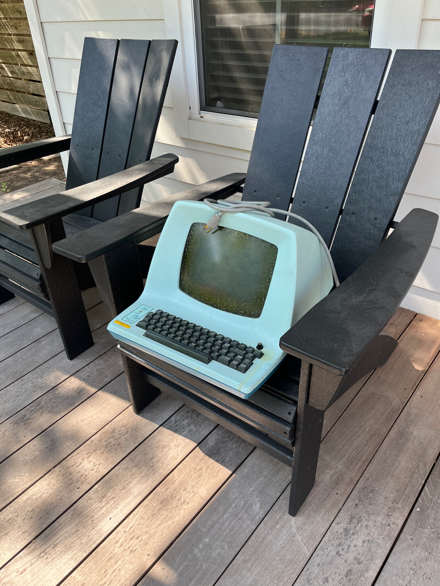

The ADM-A3 was an early "affordable" video terminal from the mid-1970s, a time when teletypes were still in common use. It was famously the terminal Bill Joy used to write `vi`, which explains a few things.

Mine showed up one day a few years ago, with a message from my friend Glen to go look on the front porch. The shape and color are from an age before beige boxes. It's really striking, but the CRT cataracts are immediately visible and will require some attention.

### Initial Assessment

The terminal was dirty but mechanically in good shape and the little LSI nameplate was intact, which is rare. It opens like a clamshell, revealing a gorgeous PCB with a whole lot of 74-series logic ICs. Unlike later terminals, this one has no microprocessor inside. It's all discrete.

I was puzzled by the ribbon cable wrapping around to the back of the PCB and was very surprised to find that there was another PCB underneath, as well as the UART that had been in the socket where the ribbon cable was plugged in. The surprise card is an extremely rare RG512 graphics card that hooks into the serial stream, intercepts Tektronix vector graphics commands, and draws them using its own video circuitry that's mixed into the main signal going to the CRT. An amazing find.

After disassembly this is what we're dealing with. Lots of big capacitors to check, at the very least.

### Initial Bring-Up

I decided to leave the RG512 out of the equation for the initial bring-up, to simplify things. Luckily it's just a matter of plugging the UART back in and rearranging some cables.

### Fixing the RG512

### Fixing the Cataracts

